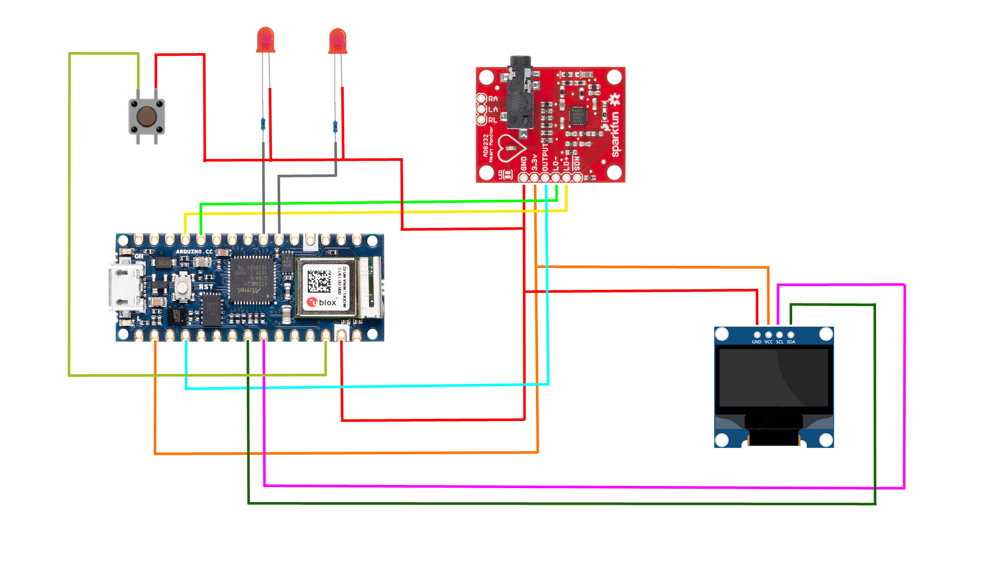

# LUMA Healt-Status Monitoring System

Device programmed using the Arduino NANO 33 IoT development board.

The program combine **Bluetooth Low Energy (BLE)** for data exchange, **AD8232** for heart monitoring and **Adafruit monitor** for display trend and BPM value.

## Instruction
Download the repository
```
 $ git clone https://github.com/lucaamantovani/LUMA-Monitoring-System
```
Open Arduino IDE, click on `Tools` and select `Boards Manager`.

Search and install the `Arduino SAMD Boards (32-bits ARM Cortex-M0+)` package.

Into the `Tools` window, select the `Arduino NANO 33 IoT` board and the correct port.

Upload the sketch and have fun!

## Circuit Diagram




## Useful Resources

> https://components101.com/modules/ad8232-ecg-module

> https://docs.arduino.cc/tutorials/nano-33-ble-sense/ble-device-to-device

> https://adafruit.github.io/Adafruit_SSD1306/html/index.html

> https://docs.arduino.cc/hardware/nano-33-iot


